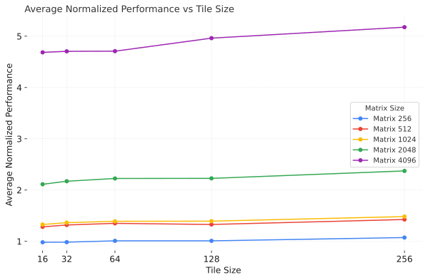

### Task 1A Unroll Baba Unroll
Pehle reorder karo baba! Phir unroll karo.

---

#### Q1. What motivated you to make changes to your code.
##### Motivation for Code Changes

Several factors motivated us to change the code. The primary reason was the **cache-unfriendly access** of the `B` matrix during multiplication.

##### Cache-Unfriendly Access of the `B` Matrix

The original IJK loop order led to significant cache misses. In the classic matrix multiplication formula `C[i * size + j] += A[i * size + k] * B[k * size + j]`, the access patterns for matrices `C` and `A` are relatively efficient. Assuming a 64-byte cache line and 8-byte doubles, we'd experience a cache miss for `C` and `A` only once every four accesses. 

However, the access pattern for matrix `B` is highly inefficient. We access `B[k * size + j]`, which means that for each new value of `j`, we jump to a different cache block. This causes a cache miss on **every single access**, significantly degrading performance.

##### Loop Overhead

We have three nested loops. Which creates a lot of branch instructions in an assembly code. From our testing, we found that $~2.2 \%$ of instructions were branch instructions. We are defining this as a `loop overhead` parameter.

Hence, if we can make matrix `B`'s access more cache-friendly and reduce the loop overhead then we should see a boost in the performance.

---

#### Q2. What considerations did you take into account when implementing those changes?

We took following considerations while implementing the changes.

##### Cache-friendly accesses

While implementing loop reordering (IKJ) we saw huge speedup ($~2.47$ times) with no real downside.

##### Tradeoff between number of instructions and speedup

Unrolling was a different story. We saw continued reduction in number of instructions (and branch instructions), but after a point, we noticed a reduction in speedup. That helped us to decide the optimal size of `stride` in loop unrolling.

---

#### Q3. How effective are your changes? (Which metric will you use to quantify effectiveness and why?)

Along with `speedup`, we used `MPKI` instead of `missrate` because in missrate, both numerator and denominator are independent from workload to workload. While in MPKI, we have a constant denominator.

Like discussed earlier, we are trying to reduce `loop overhead` using loop unrolling. To qualtify loop overhead we use:
$$ loop\ overhead = \frac{branch\ instructions}{total\ instructions}*100 $$

##### Results of loop reordering

| %20average%20speedup%20vs%20matrix%20size.svg) |
|-|
*Fig 1. average speedup vs matrix size for loop reordering*

We have taken average of 10 runs for each matrix size. Results were very volatile for smaller matrix ($< 256$) so we did not take them in account. However, we noticed loop overhead of $2.3 \%$ which we will reduce using unrolling.

#### Results of loop unrolling
We will first see effects of unrolling on number of instructions.

|  |
|-|
*Fig 2. Average instructions vs stride for loop unrolling*

We can clearly see continued reduction in the number of instructions. The reason behind this is reduced branch instructions. For example, for simple reordering we see $8.8\ billion$ branch instructions for matrix size of $2048$. But with stride of $32$ it reduces to $0.48\ billion$. This trend affects loop overhead also.

Same trend continues for loop overhead which relies on number of instructions and branch instructions. With the reduction of instructions we see reduction in loop overhead also.

|  |
|-|
*Fig 3. Loop overhead vs stride for loop unrolling*

However, after a certain point we see decrease in speedup. The overhead of branch instructions were overtaken by stalls happening due to waiting for data to arrive from memory.

|  |
|-|
*Fig 4. Loop overhead vs stride for loop unrolling*

We can confirm this observation by looking at L1D load misses for different sizes. Which shows high rise for $stride=32$.

|  |
|-|
*Fig 5. L1D load misses vs stride for loop unrolling*

#### Conclusion
After this analysis we conclude that $stride=16$ is the optimal selection. 

---

### Task 1B Divide Karo, Rule Karo

#### Deliverables 
#### 1. Profiling baseline matrix multiplication code:
- Size of L1D cache: `41.6KB` (10 instances of `416KB`)
- `MPKI` of baseline implementation:

|  |
|-|
*Fig 6. MPKI of naive implementation*

#### 2. Implementing Tiled Matrix multiplication
- L1D cache MPKI for different tile sizes.

| .svg) |
|-|
*Fig 7. MPKI for different tile size*

- Theoretically, we need a tile size that fits all three matrices in L1D cache.
$$optimal\ tile\ size = \frac{41KB}{3\times 8 \times B^2}$$
this gives us $B = 41.825$. Rounding to nearest power of two we get $B = 32$. Which is consistent with our observation in Fig 6. However, normalized performance kept increasing with increasing tile size. 

|  |
|-|
*Fig 7. Average normalized performance vs tile size*

However, speedup gain isn't significant and we see tradeoff between MPKI and runtime. Hence, we believe $B=32$ is optimal.

- **L1D MPKI vs Matrix Size**. We see here also that $B=32$ gives the least MPKI for all tested matrix sizes.

|  |
|-|
*Fig 8. L1D MPKI vs Matrix Size for different tile sizes*

- **Speedup vs Matrix size**.  Here, we see that there is no significant speedup difference between different tile sizes.

|  |
|-|
*Fig 9. Speedup vs Matrix size for different tile sizes*

---

#### Questions 
#### Q1 Report the changes in L1D MPKI observed when moving from naive to tiled matrix multiplication. Justify your observations. 

|  |
|-|
*Fig 10. Changes in L1D MPKI observed when moving from naive to tiling*

Since, our $B=32$ fits three tiles in L1D cache, we see significant reduction in L1D MPKI.

---

#### Q2. How did L1D MPKI vary across different matrix sizes and tile sizes? Explain your findings in terms of the cache hierarchy and working set sizes.

Please refer to Fig 8. to see effects of tile sizes in MPKI.

Ideally, our working set should fit in L1D cache to minimize the L1D MPKI. rom our calculations earlier with $B=32$ our working set is of:
$$
working\ set=3 \times 8 \times 32^2\ bytes = 24KB
$$

which fits perfectly in our L1D cache of size $41KB$. If we take $B=64$ then our working set becomes of size $96KB$ which does not fit in L1D cache and will result in capacity misses. 

---

#### Q3. Did you achieve a speedup? if yes, quantify the improvement and identify the contributing factors. If not, analyse the limiting factors and propose possible solutions.

Answer is both yes and no. We achieved speedup compared to naive implementation (see Fig. 9). However, we see decrease in speedup compared to loop unrolling and reordering.

|  |
|-|
*Fig 11. Changes in L1D MPKI observed when moving from naive to tiling*

The only possible limiting factors we were able to notice was loop overhead. Like we discussed earlier, reordering+unrolling reduces loop overhead to about $~0.6\%-0.65\%$ depending on different matrix size. However, we see loop overhead of $2.1\%-2.3\%$ in tiling. We also compared MPKI of both and we see higher MPKI for tiling.

|  |
|-|
*Fig 12. MPKI of tiling and reordering*

### Conclusion

While tiling provides a speedup over naive implementation. It runs worse than loop reordering and unrolling. Our conclusion is that loop overhead is the limiting factor.

---

### Task 1C Data Ko Line Mein Lagao

#### Deliverables
#### 1. Baseline Profiling:
- **Number of instructions** executed for naive matrix multiplication:

|  |
|-|
*Fig 13. Average instructions executed by naive implementation*

#### 3. Instruction Count and Performance Analysis:
- **Number of Instructions** executed by SIMD implementation.

|  |
|-|
*Fig 14. Average instructions executed by SIMD implementation*

- **Compare performance** between naive and SIMD implementations by calculating the speedup achieved.

|  |
|-|
*Fig 15. speedup achieved by simd*

---

#### Questions
#### Q1. Report the change in the number of instructions you observed when moving from naive to the SIMD implementation. Justify your observations.

|  |
|-|
*Fig 16. Instruction count of SIMD and naive*

The reason behind the reduced instructions is we essentially have 3 times less arithmatic instructions (4 doubles are getting processed in a single instruction). While we do have some extra simd specific instructions, it is still less than 4 times arithmatic instructions.

---

#### Q2. Did you achieve any speedup? if so, how much, and what contributed to it? if not, what were the reasons?

Yes, we did achieve speedup:

|  |
|-|
*Fig 17. Speedup acheived by SIMD implementation*

Main factor contributing to the speedup is parallelism. We are processing four doubles in parallel. It also reduced loop iterations and number of instructions.

---

#### Q3. Which SIMD intrinsics did you use? justify your choice of functions.

We used following intrinsics:
- `_mm256_broadcast_sd` to broadcast a single element of matrix `A` to four elements of matrix `B`.
- `_mm256_loadu_pd` to load data from C array. Since, addresses may not be aligned ($addr\ mod\ 32\ \ne 0$) we use the unaligned version.
- `_mm256_mul_pd` to multiply two `__m256d`
- `_mm256_add_pd` to add two `__m256d`.
- `_mm256_storeu_pd` to finally store result back in C array.

---

### Task 1D: Rancho's Final Year Project

Here, we compare each optimization techniques. Both SIMD and Tiling implementations use loop reordering also. `Combined` includes Tiling + SIMD.

|  |
|-|
*Fig 18. Speedup achieved by different optimizations*

---

#### Conclusion
SIMD + Reodering gives the most speedup, with Tiling + SIMD coming close second.